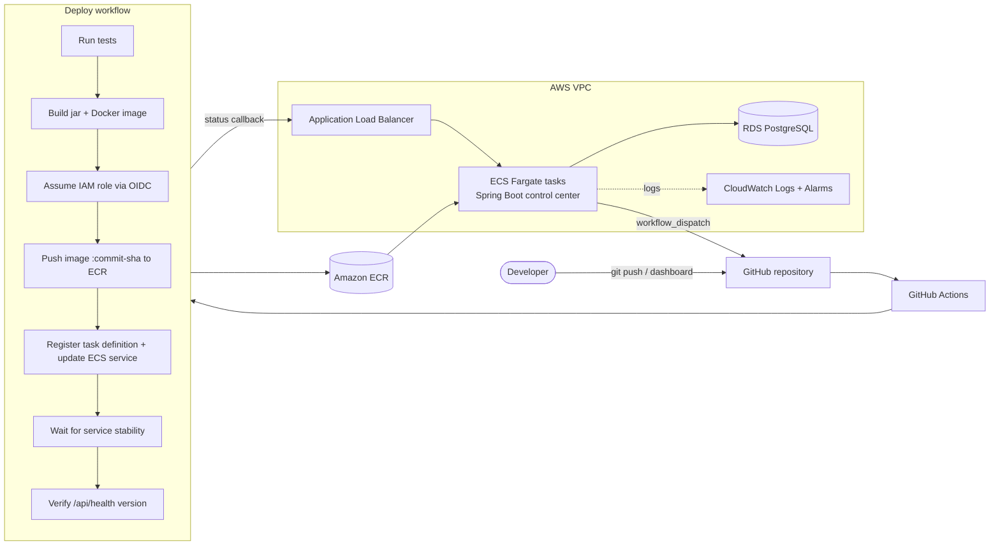
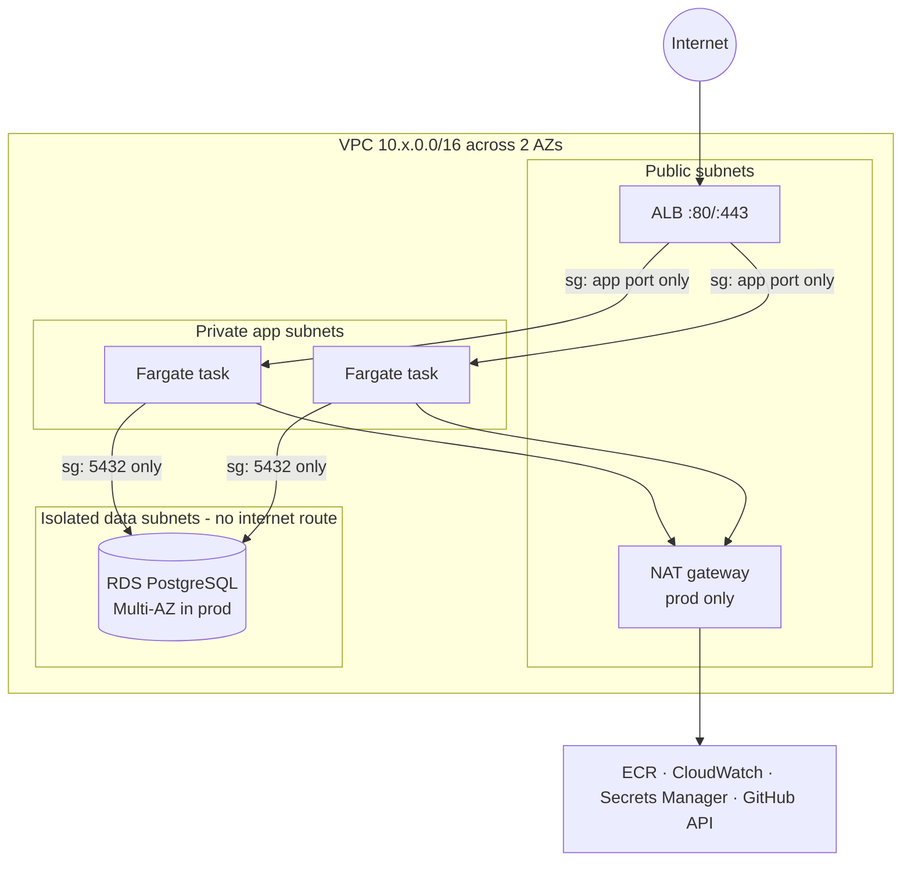
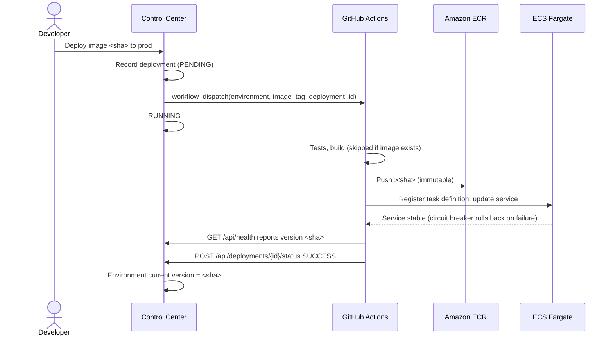

# Cloud Deployment Control Center

A small **internal developer platform** for registering applications, managing their
`dev` / `prod` environments, triggering deployments and rolling back to earlier versions on AWS.

The control plane is a Java 21 / Spring Boot application. Workloads ship through
**GitHub Actions → Docker → Amazon ECR → Amazon ECS Fargate** behind an **Application Load Balancer**,
with **Amazon RDS PostgreSQL** for state and **Amazon CloudWatch** for logs, alarms and a dashboard.
All AWS infrastructure is defined in **Terraform**, and CI/CD signs in to AWS through **GitHub OIDC**,
so no long-lived AWS keys exist anywhere.

The control center deploys itself with the same pipeline it drives for other applications.

---

## Contents

- [What it does](#what-it-does)
- [Architecture](#architecture)
- [Technology stack](#technology-stack)
- [Local setup](#local-setup)
- [Docker](#docker)
- [Terraform](#terraform)
- [AWS architecture](#aws-architecture)
- [GitHub Actions](#github-actions)
- [Deployment process](#deployment-process)
- [Rollback](#rollback)
- [Security](#security)
- [Monitoring](#monitoring)
- [REST API](#rest-api)
- [Project structure](#project-structure)
- [Further documentation](#further-documentation)

## What it does

| Capability | How |
|---|---|
| Register and view applications | An application is one GitHub repository that produces one container image |
| Manage environments | `dev`, `prod` (or any name) per application, each with its own status, health and current version |
| Create deployments | Pick an immutable image tag (commit SHA); the platform records it and dispatches the GitHub Actions deploy workflow |
| Track deployment status | `PENDING → RUNNING → SUCCESS / FAILED`, reported back by the pipeline through a callback API |
| Deployment history | Per environment, per application, and a global history page you can filter and page through |
| Rollback | One click redeploys the previous successful image. The replaced deployment becomes `ROLLED_BACK` |
| Basic health | Scheduled HTTP probes of each environment's `/api/health` through its load balancer |

Screens: dashboard (KPIs, environment overview, recent deployments), applications, application
detail, environment detail (deploy form, history, rollback), deployment detail (pipeline log).

## Architecture



The Java application is the **control plane**. It stores applications, environments and
deployments, and triggers deployments through the GitHub Actions API. The **data plane** is the
GitHub Actions → ECR → ECS pipeline. See [docs/architecture.md](docs/architecture.md).

## Technology stack

| Area | Technology |
|---|---|
| Application | Java 21, Spring Boot 3.5 (Web, Data JPA, Validation, Actuator), Thymeleaf |
| Database | PostgreSQL 16 (RDS in AWS, Docker locally), Flyway migrations |
| Build | Maven (wrapper included) |
| Container | Multi-stage Dockerfile, layered jar, Eclipse Temurin 21 JRE (Alpine), non-root |
| Infrastructure as Code | Terraform ≥ 1.11, AWS provider 6.x, S3 remote state with native locking |
| AWS | VPC, ALB, ECS Fargate, ECR, RDS PostgreSQL, IAM, Secrets Manager, CloudWatch |
| CI/CD | GitHub Actions with OIDC federation to AWS IAM |
| Quality gates | JUnit 5 / MockMvc (69 tests), hadolint, `terraform validate`, Checkov, actionlint-clean workflows |

## Local setup

Prerequisites: Docker with Compose v2, or JDK 21 for running outside containers.

```bash
cp .env.example .env              # local-only values, git-ignored
docker compose up --build         # PostgreSQL + control center
open http://localhost:8080        # dashboard
curl http://localhost:8080/api/health
```

Run the tests (in-memory H2 in PostgreSQL mode, so no external services are needed):

```bash
./mvnw test        # unit, slice and integration tests
./mvnw package     # builds target/control-center.jar
```

Run against your own PostgreSQL without Docker:

```bash
DB_HOST=localhost DB_PASSWORD=... ./mvnw spring-boot:run
```

| Variable | Default | Purpose |
|---|---|---|
| `DB_HOST`, `DB_PORT`, `DB_NAME` | `localhost`, `5432`, `controlcenter` | PostgreSQL location |
| `DB_USERNAME`, `DB_PASSWORD` | `controlcenter`, empty | Credentials (Secrets Manager in AWS) |
| `DB_SSL_MODE` | `prefer` | `require` in AWS (RDS enforces TLS) |
| `APP_VERSION`, `APP_ENVIRONMENT` | `local` | Reported by `/api/health`; set by the pipeline |
| `HEALTH_CHECK_ENABLED` | `true` | Background probes of environment URLs |
| `GITHUB_DISPATCH_ENABLED`, `GITHUB_TOKEN` | `false`, empty | Trigger GitHub Actions from the dashboard |
| `LOGGING_STRUCTURED_FORMAT_CONSOLE` | unset | `ecs` in AWS for JSON logs |

Without a GitHub token the platform still records deployments. You run the workflow yourself
and report the result with the status API or the buttons on the deployment page.

## Docker

- **Multi-stage build.** A Maven + JDK 21 build stage, then an `eclipse-temurin:21-jre-alpine` runtime.
- **Layered jar.** Dependencies, loader, snapshot dependencies and application classes are separate image layers, so code-only changes rebuild one small layer.
- **Runs as non-root** (UID 10001). Application files are root-owned and read-only for the app user. In ECS the root filesystem is read-only too, and only `/tmp` is writable.
- **No secrets in the image.** All configuration comes from environment variables.
- **Health check** against `/api/health`, which the ALB and the ECS container health check also use.
- **JVM sized to the container**: `-XX:MaxRAMPercentage=75`.

```bash
docker build -t control-center:dev .
```

## Terraform

```
infra/terraform/
├── modules/
│   ├── networking/   VPC, public/app/data subnets, NAT, security groups
│   ├── ecr/          immutable repository, scan on push, lifecycle policy
│   ├── alb/          load balancer, target group, HTTP(S) listeners
│   ├── ecs/          cluster, log group, task definition, service (circuit breaker)
│   ├── rds/          PostgreSQL, parameter group, credentials secret
│   ├── iam/          task execution role, task role, GitHub OIDC deploy role
│   └── monitoring/   CloudWatch alarms, log metric filter, dashboard
└── environments/
    ├── dev/          cost-optimised (no NAT, single-AZ DB, 1 task)
    └── prod/         NAT, Multi-AZ RDS, 2 tasks, deletion protection
```

```bash
cd infra/terraform/environments/dev
cp backend.hcl.example backend.hcl          # S3 state bucket
cp terraform.tfvars.example terraform.tfvars
terraform init -backend-config=backend.hcl
terraform plan
terraform apply
terraform output github_environment_variables
```

Full details, including the bootstrap order and costs, are in [docs/infrastructure.md](docs/infrastructure.md).

## AWS architecture



Security groups chain the tiers: internet → ALB → ECS → RDS. Each rule points at the next
tier's security group rather than a CIDR range. RDS sits in subnets with no internet route and
`publicly_accessible = false`.

## GitHub Actions

| Workflow | Trigger | Purpose |
|---|---|---|
| [`ci.yml`](.github/workflows/ci.yml) | Pull requests | Maven tests and package, hadolint, Docker build, container smoke test with `docker compose` |
| [`terraform.yml`](.github/workflows/terraform.yml) | Changes under `infra/` | `terraform fmt -check`, `terraform validate` per environment, Checkov scan |
| [`deploy.yml`](.github/workflows/deploy.yml) | Push to `main`, manual run, dashboard | Test, build, push to ECR, deploy to ECS, verify, report back |

Dependabot keeps Maven, Docker, GitHub Actions and Terraform providers up to date.
See [docs/ci-cd.md](docs/ci-cd.md).

## Deployment process



- **Push to `main`** deploys the commit to `dev`.
- **Production** is deployed with *Run workflow* (`environment=prod`, `image_tag=<sha>`) or from the dashboard. Protect the `prod` GitHub environment with required reviewers.

Step-by-step instructions: [docs/deployment.md](docs/deployment.md).

## Rollback

A rollback is an ordinary deployment of an image that is already in ECR:

1. The environment page offers *Roll back to &lt;previous version&gt;*, or a rollback to any earlier successful deployment in the history.
2. The control center creates a deployment flagged `rollback` and dispatches the workflow with the old image tag.
3. The workflow finds the image in ECR, **skips the build** and only updates the ECS service.
4. When the rollback succeeds, the deployment it replaced is marked `ROLLED_BACK`. If it fails, the live version stays untouched.

ECS adds a second safety net. The **deployment circuit breaker** automatically returns the service
to the last working task definition when new tasks never become healthy.

## Security

- **No long-lived credentials.** GitHub Actions assumes a per-environment IAM role through OIDC. The trust policy only accepts tokens for `repo:<owner>/<repo>:environment:<env>`.
- **Least-privilege IAM.**
  - The deploy role can push only to its own ECR repository, update only its own ECS service, and pass only its own task roles (to `ecs-tasks.amazonaws.com`).
  - The task execution role can read only its own image, log group and secrets.
  - The task role is empty.
- **Database credentials** are generated by Terraform as an *ephemeral* value and written through *write-only* arguments to RDS and Secrets Manager. They never appear in Terraform state, the image, the task definition or Git. ECS injects them at container start.
- **Network isolation.** Private subnets, chained security groups, RDS without public access and with TLS enforced (`rds.force_ssl=1`), and the default security group stripped of all rules.
- **Hardened containers.** Non-root user, read-only root filesystem, no secrets in the image.
- **Never committed.** `.env`, `*.tfvars`, `backend.hcl`, Terraform state and build output are all git-ignored. Only `*.example` templates are tracked.

The dashboard has no login by design for this MVP. Restrict the ALB with `alb_ingress_cidrs`.
See [docs/security.md](docs/security.md) for the threat model and the accepted trade-offs.

## Monitoring

CloudWatch only:

- **Logs:** ECS ships container output to `/ecs/<project>-<env>` as ECS-format JSON, ready for Logs Insights queries.
- **Alarms:**

  | Area | Alarms |
  |---|---|
  | ECS | CPU > 80%, memory > 80% |
  | ALB | unhealthy targets, no healthy targets, target 5xx |
  | Application | ERROR log rate (metric filter on `$.log.level`) |
  | RDS | CPU, free storage |

- **Dashboard:** ECS, ALB, RDS and error-log widgets (Terraform output `cloudwatch_dashboard_url`).
- **In-app health:** the control center probes each environment's `/api/health` and shows the result.

Alarm notifications are optional: pass existing SNS topic ARNs as `alarm_actions`.

## REST API

| Method | Path | Description |
|---|---|---|
| `GET` | `/api/health` | Liveness, version and environment |
| `GET` / `POST` | `/api/applications` | List / register applications |
| `GET` / `PUT` | `/api/applications/{id}` | Get / update an application |
| `GET` / `POST` | `/api/applications/{id}/environments` | List / create environments |
| `GET` / `PATCH` | `/api/environments/{id}` | Get an environment / update its URL |
| `POST` | `/api/environments/{id}/health-check` | Run a health probe now |
| `GET` / `POST` | `/api/environments/{id}/deployments` | Deployment history / deploy an image |
| `POST` | `/api/environments/{id}/rollback` | Roll back (optional `targetDeploymentId`, `reason`) |
| `GET` | `/api/deployments?status=&page=&size=` | Paged deployment history |
| `GET` | `/api/deployments/{id}` | Deployment details |
| `POST` | `/api/deployments/{id}/status` | Pipeline status callback (`RUNNING`, `SUCCESS`, `FAILED`) |

```bash
curl -X POST localhost:8080/api/environments/1/deployments \
  -H 'Content-Type: application/json' \
  -d '{"imageTag":"3f2a9c1e5b7d4f6a8c0e2b4d6f8a0c2e4b6d8f0a","message":"Add rollback UI"}'
```

## Project structure

```
.
├── src/main/java/com/controlcenter/
│   ├── api/            REST controllers, DTOs, JSON error handling
│   ├── web/            Thymeleaf controllers and form objects
│   ├── service/        application, environment, deployment, rollback, health logic
│   ├── domain/         JPA entities and status lifecycles
│   ├── repository/     Spring Data repositories
│   ├── github/         GitHub Actions workflow dispatch client
│   └── config/         typed configuration properties
├── src/main/resources/ application.yml, Flyway migrations, templates, CSS
├── src/test/           unit, MockMvc, JPA and integration tests
├── infra/terraform/    modules + dev/prod environments
├── .github/            CI, Terraform and deploy workflows, Dependabot
├── docs/               architecture, deployment, infrastructure, CI/CD, security
├── Dockerfile · docker-compose.yml · .env.example · pom.xml
```

## Further documentation

- [Architecture](docs/architecture.md): components, domain model, design decisions
- [Deployment](docs/deployment.md): first-time AWS setup, deploying, promoting, rolling back
- [Infrastructure](docs/infrastructure.md): Terraform modules, environments, state, costs
- [CI/CD](docs/ci-cd.md): workflows, OIDC, GitHub environment configuration
- [Security](docs/security.md): IAM, secrets, network, accepted risks
