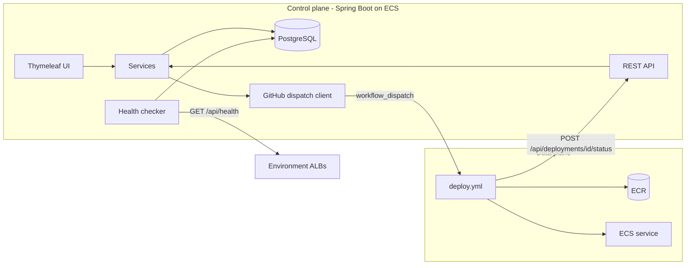
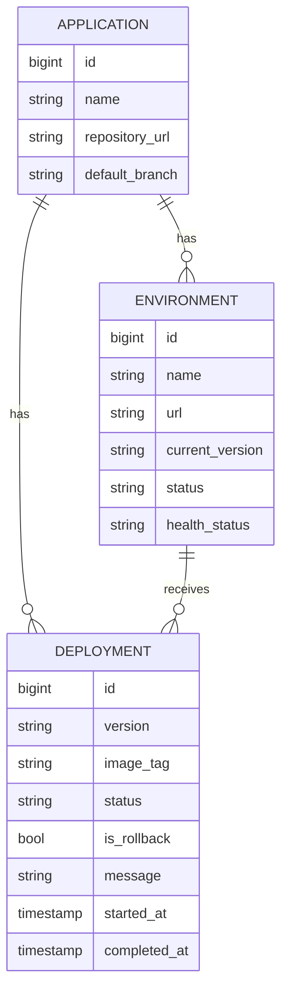
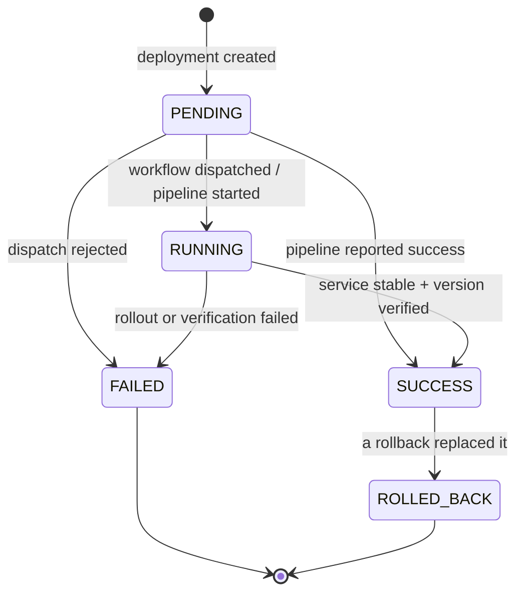

# Architecture

## Overview

The Cloud Deployment Control Center is a **control plane** for container deployments. It does
not run Docker or call ECS itself. It records intent (which image should run where), hands
execution to the **data plane** (the GitHub Actions deploy workflow), and tracks the outcome
reported back by the pipeline.

Keeping the two planes apart means the platform never holds AWS deploy permissions. Its ECS task
role is empty. All AWS changes happen in short-lived, audited GitHub Actions jobs that use OIDC.

## Application components

| Package | Responsibility |
|---|---|
| `domain` | `Application`, `Environment`, `Deployment` entities. Status rules live here (`DeploymentStatus.canTransitionTo`, `Environment.deploymentSucceeded/Failed`) |
| `repository` | Spring Data JPA repositories. Entity graphs avoid lazy-loading outside transactions (`open-in-view` is disabled) |
| `service` | `DeploymentService` (lifecycle and dispatch), `RollbackService`, `EnvironmentHealthChecker` (scheduled probes), `DashboardService` |
| `github` | `WorkflowDispatcher` interface and its GitHub REST implementation |
| `api` | JSON REST controllers, request/response records, consistent `ApiError` responses |
| `web` | Server-rendered pages (Thymeleaf), form beans, redirect-after-post with flash messages |

## Domain model

### Deployment lifecycle

Environment state follows from its deployments:

| Event | Environment status | Current version |
|---|---|---|
| deployment created / running | `DEPLOYING` | unchanged |
| deployment succeeded | `ACTIVE` | deployment version |
| deployment failed (a version is live) | `ACTIVE` | unchanged. ECS keeps the old tasks |
| deployment failed (nothing live yet) | `FAILED` | none |

`healthStatus` (`UNKNOWN`, `HEALTHY`, `UNHEALTHY`) is kept separately. It comes from HTTP probes of
`<environment url>/api/health`.

## Key design decisions

| Decision | Rationale |
|---|---|
| Immutable image tags (commit SHA), `latest` rejected | A deployment record always points to exactly one image, which makes rollbacks deterministic. ECR enforces `IMMUTABLE` tags |
| Only one in-progress deployment per environment | Prevents racing rollouts. The deploy workflow also serialises per environment with a `concurrency` group |
| Workflow dispatched outside DB transactions | No database locks held during HTTP calls. The outcome is recorded in a second short transaction |
| Rollback = redeploy an existing image | No rebuild. Fast and identical to the previously verified artifact |
| Replaced deployment marked `ROLLED_BACK` only after the rollback succeeds | A failed rollback leaves history consistent with what is actually running |
| Terraform owns the task definition, CI owns the image | Infra settings (CPU, roles, secrets) change through code review. The service ignores `task_definition` drift caused by deployments |
| `/api/health` does not query the database | A brief RDS failover does not make ECS replace every task |
| Server-side rendering | A small, dependency-free UI. The project's focus is infrastructure and delivery |
| H2 (PostgreSQL mode) for tests, same Flyway migrations | Fast, self-contained test suite. The migrations are portable SQL and are also checked against PostgreSQL 16 |

## Request flow in AWS

1. The client resolves the ALB DNS name. The ALB accepts `:80` (or `:443` with a certificate).
2. The ALB forwards to a healthy Fargate task's IP on port 8080 (target type `ip`).
3. Spring Boot serves the page or API and talks to RDS over TLS.
4. Logs go to stdout as JSON. The `awslogs` driver ships them to CloudWatch Logs.
