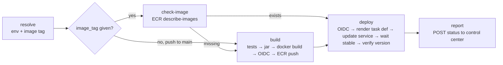
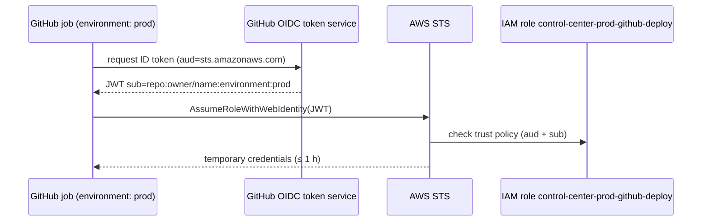

# CI/CD

Three GitHub Actions workflows cover validation and delivery. None of them stores AWS credentials.

## Workflows

### `ci.yml`: pull request validation

| Job | Steps |
|---|---|
| Java tests and build | Checkout → Java 21 (Temurin, Maven cache) → `./mvnw verify` → upload Surefire reports on failure |
| Docker build and smoke test | hadolint → Buildx build (GitHub Actions cache) → `docker compose up --wait` with PostgreSQL → `GET /api/health`, `POST /api/applications`, render the dashboard → logs on failure → teardown |

### `terraform.yml`: infrastructure validation

Runs on changes under `infra/terraform/**`:

- `terraform fmt -check -recursive`
- `terraform init -backend=false -lockfile=readonly` and `terraform validate` for **dev** and **prod** (matrix)
- Checkov static analysis using `.checkov.yaml`. Every skipped check is listed with its justification

No AWS access is needed. `plan` and `apply` are run by an operator (see [deployment.md](deployment.md)).

### `deploy.yml`: build and deploy



| Trigger | Environment | Image |
|---|---|---|
| Push to `main` (application changes) | `dev` | Built from the pushed commit |
| *Run workflow* | `dev` or `prod` | `image_tag` input, or the branch head |
| Control center dashboard | Chosen environment | Chosen tag, plus `deployment_id` for the callback |

Details:

- **Ordering.** Tests run before any AWS credentials exist in the job. OIDC is configured right before the push.
- **Immutable tags.** Images are tagged with the commit SHA; `latest` is never used. ECR rejects overwriting a tag.
- **Skip the build when the image exists.** That is how promotions and rollbacks redeploy the exact artifact that was verified earlier.
- **Task definition.** The workflow downloads the latest revision of the Terraform-managed family and swaps only the image and `APP_VERSION`.
- **Stability.** `amazon-ecs-deploy-task-definition` waits for the service to reach a steady state (up to 20 minutes). The ECS circuit breaker rolls back tasks that never become healthy.
- **Verification.** Polls `APP_URL/api/health` until the reported `version` equals the deployed tag.
- **Concurrency.** One run per environment (`deploy-<env>`). A rollout in progress is never cancelled.
- **Reporting.** If the run carries a `deployment_id` and `CONTROL_CENTER_URL` is set, the final job posts `SUCCESS` or `FAILED` with a link to the run.

## OIDC authentication



The `sub` condition is pinned to the repository **and** the GitHub environment. A workflow on a
fork, on a pull request, or in another environment cannot assume the role. Jobs request
`id-token: write` only where they need AWS. Every other job has `contents: read`.

### Deploy role permissions

| Statement | Actions | Resource |
|---|---|---|
| ECR auth | `ecr:GetAuthorizationToken` | `*` (not resource-scoped) |
| ECR push/pull | layer upload, `PutImage`, `BatchGetImage`, `DescribeImages` | this environment's repository |
| Task definitions | `ecs:DescribeTaskDefinition`, `ecs:RegisterTaskDefinition` | `*` (not resource-scoped) |
| Service | `ecs:UpdateService`, `ecs:DescribeServices` | this environment's service |
| Pass roles | `iam:PassRole` with `iam:PassedToService = ecs-tasks.amazonaws.com` | this environment's task roles |

## GitHub configuration checklist

- [ ] Environments `dev` and `prod` exist, with the variables from `terraform output github_environment_variables`
- [ ] `prod` requires reviewers and only allows deployments from `main`
- [ ] Branch protection on `main` requires the `CI` and `Terraform` checks
- [ ] Optional: the repository variable `CONTROL_CENTER_URL` for status callbacks
- [ ] Dependabot alerts and security updates are enabled (`.github/dependabot.yml`)

## Running the checks locally

```bash
./mvnw verify
docker build -t control-center:local .
hadolint Dockerfile
actionlint
terraform fmt -check -recursive infra/terraform
```
