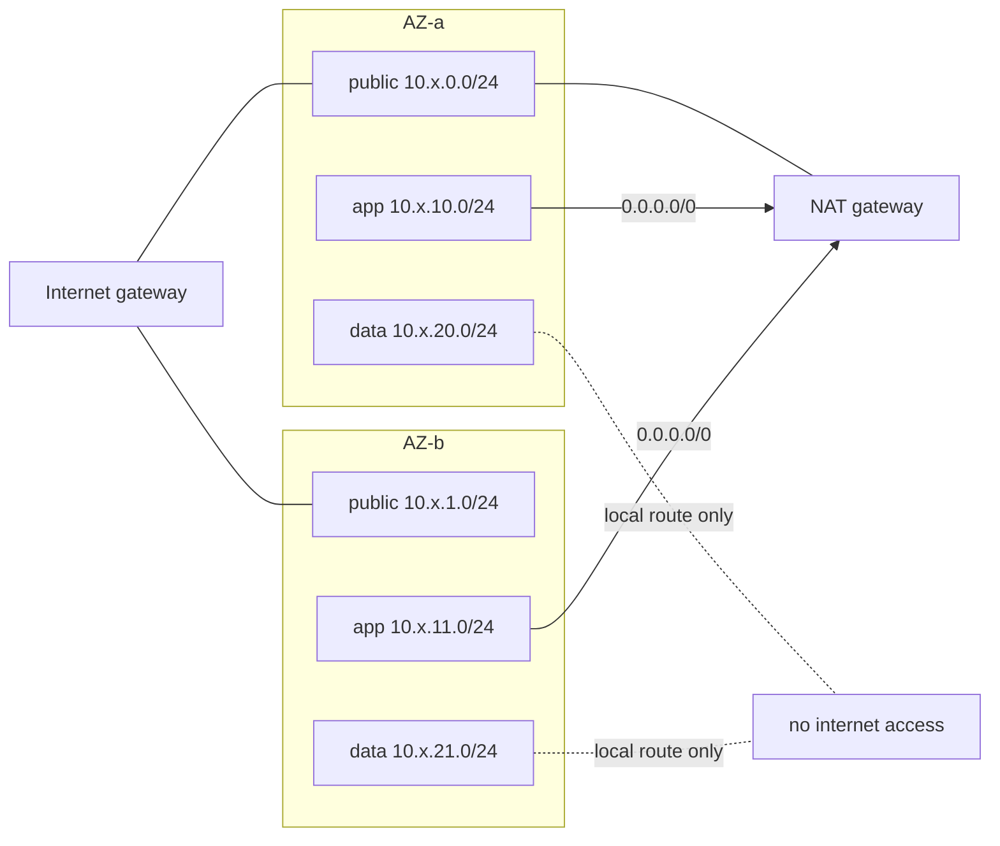

# Infrastructure

All AWS resources are defined in Terraform under `infra/terraform`. Terraform is the single
source of truth. The only thing changed outside Terraform is the running image, which the deploy
workflow manages (see [Ownership boundary](#ownership-boundary)).

## Layout

| Path | Contents |
|---|---|
| `modules/networking` | VPC, 2 public + 2 app + 2 data subnets, internet gateway, optional NAT gateway, route tables, ALB/ECS/RDS security groups, locked-down default security group |
| `modules/ecr` | Repository with `IMMUTABLE` tags, scan on push, lifecycle (expire untagged after 7 days, keep the last 30 images) |
| `modules/alb` | Internet-facing ALB, `ip` target group with `/api/health` health check, HTTP listener (forwards, or redirects to HTTPS when a certificate is set), optional HTTPS listener with TLS 1.2/1.3 policy |
| `modules/ecs` | Fargate cluster, CloudWatch log group, task definition (read-only root FS, health check, secrets), service with rolling deployment and circuit breaker |
| `modules/rds` | PostgreSQL 16, encrypted gp3 storage with autoscaling, `rds.force_ssl`, backups, log exports, credentials secret (ephemeral password, write-only) |
| `modules/iam` | ECS task execution role, ECS task role, GitHub OIDC provider and deploy role |
| `modules/monitoring` | CloudWatch alarms, error-log metric filter, dashboard |
| `environments/dev`, `environments/prod` | Root modules that wire the modules together with environment-specific defaults |

Modules are small and single-purpose. Each environment is its own root module with its own state
file, so a `dev` change can never touch `prod`.

## Environments

| Setting | dev | prod |
|---|---|---|
| VPC CIDR | `10.10.0.0/16` | `10.20.0.0/16` |
| NAT gateway | no: tasks in public subnets with public IP, inbound only from the ALB | yes: tasks in private app subnets |
| ECS tasks | 1 × 0.5 vCPU / 1 GiB | 2 × 0.5 vCPU / 1 GiB |
| Container Insights | off | on |
| RDS | `db.t4g.micro`, single-AZ, 3-day backups, no deletion protection | `db.t4g.small`, Multi-AZ, 14-day backups, deletion protection, final snapshot |
| Log retention | 14 days | 90 days |
| ALB deletion protection | off | on |
| ECR `force_delete` | on | off |
| Secret recovery window | 0 days | 7 days |

## Network design



| Security group | Inbound | Outbound |
|---|---|---|
| ALB | 80 (and 443 with a certificate) from `alb_ingress_cidrs` | app port to the ECS SG |
| ECS tasks | app port from the ALB SG | 443 (AWS APIs, GitHub), 80 (health probes), 5432 to the RDS SG |
| RDS | 5432 from the ECS SG | none |

A single NAT gateway keeps cost down. For full AZ independence, use one per AZ.

## Remote state

```hcl
# backend.hcl (git-ignored); template: backend.hcl.example
bucket       = "<state-bucket>"
key          = "control-center/<env>/terraform.tfstate"
region       = "eu-central-1"
encrypt      = true
use_lockfile = true   # S3 native locking, Terraform >= 1.10
```

State never contains the database password: it is created with an `ephemeral "random_password"`
and passed only to the write-only arguments `password_wo` and `secret_string_wo`. Provider lock
files (`.terraform.lock.hcl`) are committed for both environments, with hashes for Linux and macOS.

## Ownership boundary

| Owned by Terraform | Owned by the deploy workflow |
|---|---|
| Task definition settings: CPU, memory, roles, env vars, secrets, health check, logging | The container image and `APP_VERSION` |
| ECS service settings: networking, load balancer, desired count, deployment config | Which task definition revision is active |

The workflow always starts from the **latest** task definition revision and replaces only the image.
Terraform changes therefore go live with the next deployment. The service has
`ignore_changes = [task_definition]`, so `terraform apply` never reverts a deployment.
To roll out a Terraform-only change immediately, run the deploy workflow with the current image tag.

## Variables worth knowing

| Variable | Purpose |
|---|---|
| `github_repository` | `owner/name` allowed to assume the deploy role (required) |
| `alb_ingress_cidrs` | Who can reach the dashboard. Restrict it for an internal tool |
| `certificate_arn` | ACM certificate. Turns on HTTPS and the HTTP→HTTPS redirect |
| `github_token_secret_arn` | Turns on workflow dispatch from the dashboard |
| `alarm_actions` | SNS topic ARNs for alarm notifications |
| `db_password_version` | Increment to rotate the database password |
| `enable_execute_command` | ECS Exec for debugging (adds the SSM permissions to the task role) |
| `create_github_oidc_provider` | Only one GitHub OIDC provider may exist per account |

## Validation

```bash
terraform fmt -check -recursive infra/terraform
cd infra/terraform/environments/dev && terraform init -backend=false && terraform validate
checkov -d infra/terraform --config-file .checkov.yaml
```

The same checks run in `.github/workflows/terraform.yml`.

## Rough monthly cost (eu-central-1, on-demand, low traffic)

| Item | dev | prod |
|---|---|---|
| ALB | ~$20 | ~$20 |
| Fargate (0.5 vCPU / 1 GiB per task) | ~$18 | ~$36 |
| RDS | ~$15 (t4g.micro) | ~$60 (t4g.small Multi-AZ) |
| NAT gateway | – | ~$35 + data |
| Public IPv4, Secrets Manager, CloudWatch, ECR | ~$10 | ~$15 |
| **Approximate total** | **~$65** | **~$170** |

These are estimates only. Use the AWS Pricing Calculator for real numbers. Destroy `dev` when you
aren't using it.
